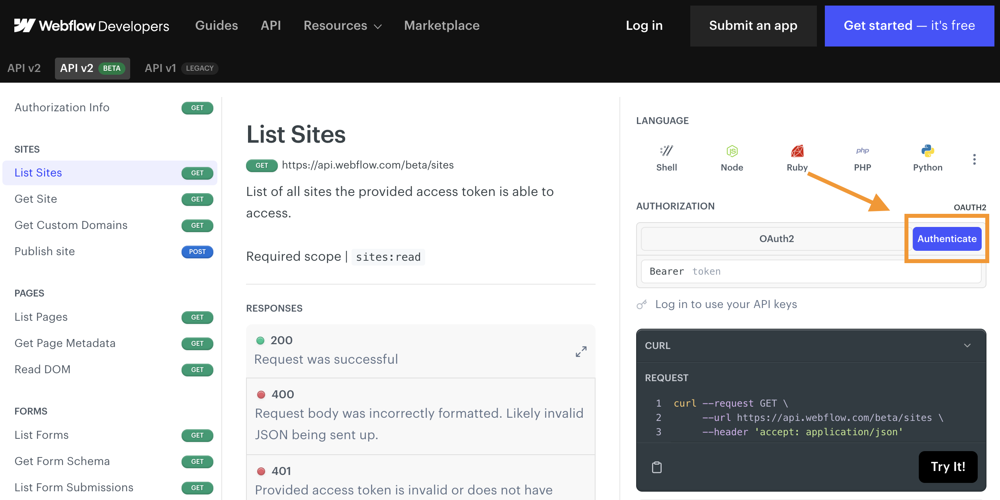

# Localizing a Site

## What is Localization?

Webflow Localization is a native, end-to-end solution for customizing your website for visitors around the world --from design to translation to publishing.

For businesses of any size to scale internationally, they need to be able to truly tailor their websites to resonate with global audiences. Localization includes but goes far beyond translation, or simply converting the text on your site to a different language. It means customizing anything from the design to what images you choose to unique content per locale. It also means making sure your site is easily discoverable by the people and prospects in the regions you’re targeting.

## How can I use these APIs?

Webflow's localization APIs empower developers to efficiently automate and manage the localization process across multiple sites, ensuring consistency and quality. With these APIs, your apps can help users make dynamic content updates and enable custom localization workflows, providing scalability for growing businesses that are looking to enhance global user engagement and optimize performance for international audiences.

---
# Tutorial
In this tutorial, we'll use a mockup site for a fintech application, AstralFund, and walk through the process of localizing content for a French audience. By the end of this tutorial, you'll have a fully localized “Contact Us” page and a new testimonial that resonates with your French audience. Ready to start? Let's dive in!

### What You’ll Learn
- [ ] Identifying primary and secondary locales within Webflow.
- [ ] Localizing the DOM elements like text and images.
- [ ] Optimizing SEO data for different locales.
- [ ] Managing CMS content across multiple locales.

### What You'll Need
- [ ] [AstralFund Site Cloneable](https://webflow.com/design/astralfund-919afdc1091df68b8dc1347f952a)
- [ ] Our [Localization Example Repo](https://github.com/Webflow-Examples/Localization-Demo) with code samples and localized data
- [ ] A Webflow site plan that supports CMS
- [ ] A Bearer Key
- [ ] Some knowledge of HTTP requests and JavaScript

### Localization in Action
AstralFund, an imaginary bank for this example, serves two locales, the United States and France. To properly address each market’s needs, the bank needs to localize content throughout the site. In the example, we’ve localized some content, but we’ll walk through how to localize the entire site in this tutorial.

|  |  |
| -------- | ------- |
|  |  |
| **Primary Locale: United States 🇺🇸**  | **Secondary Locale: France 🇫🇷**  |
The site's primary locale is set to the United States with content in English. | A secondary locale for France is available, with the homepage localized in French. Notice, the localized image and the decimals replaced by commas. However, some content, like the testimonials, still needs to be localized. |

### Step 1: Clone Site and Identify Localization Opportunities
- [ ] Clone the [AstralFund site](https://webflow.com/design/astralfund-919afdc1091df68b8dc1347f952a) to your Webflow account, and add it to a workspace used for testing.
- [ ] Publish the site to set it live.
- [ ] Navigate to the French version to see the localized French homepage.
- [ ] Navigate to the Contact page in French. Note the content that is not yet localized. We’ll fix this by localizing the navigation bar, contact content, form, footer, and SEO data.

### Step 2: Retrieve Locale Information
- [ ] Make sure you have a valid Bearer Key in order to make API calls. You can easily do this by authenticating through our API reference docs. Once you have your Bearer Key, store it in your `.env` file as `WEBFLOW_API_TOKEN`

- [ ] Initialize the API using the [Webflow Javascript SDK](https://github.com/webflow/js-webflow-api)
- [ ] 

