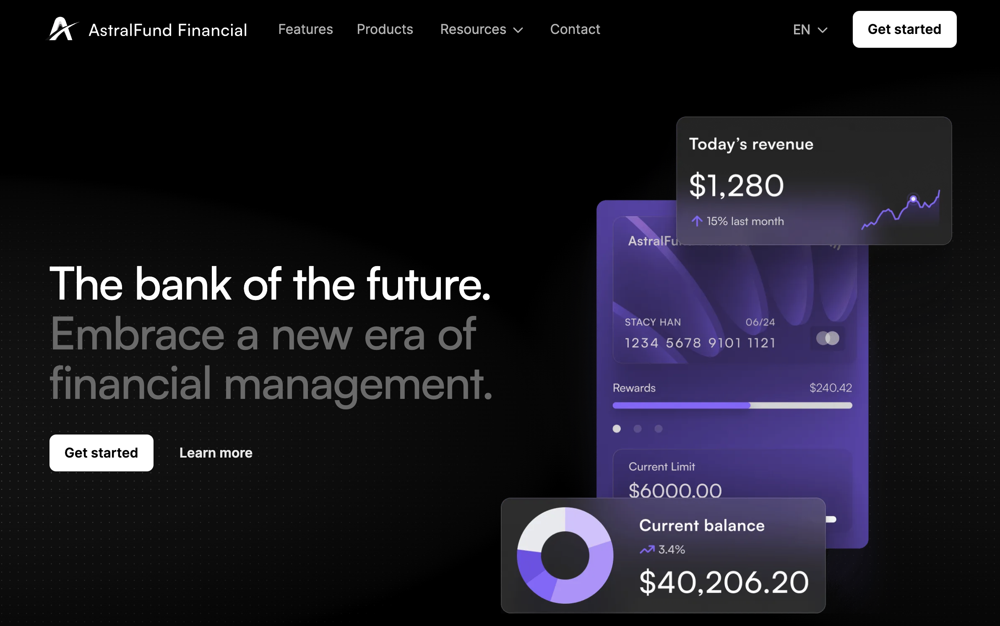
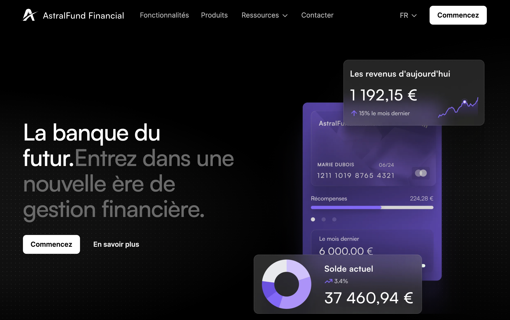
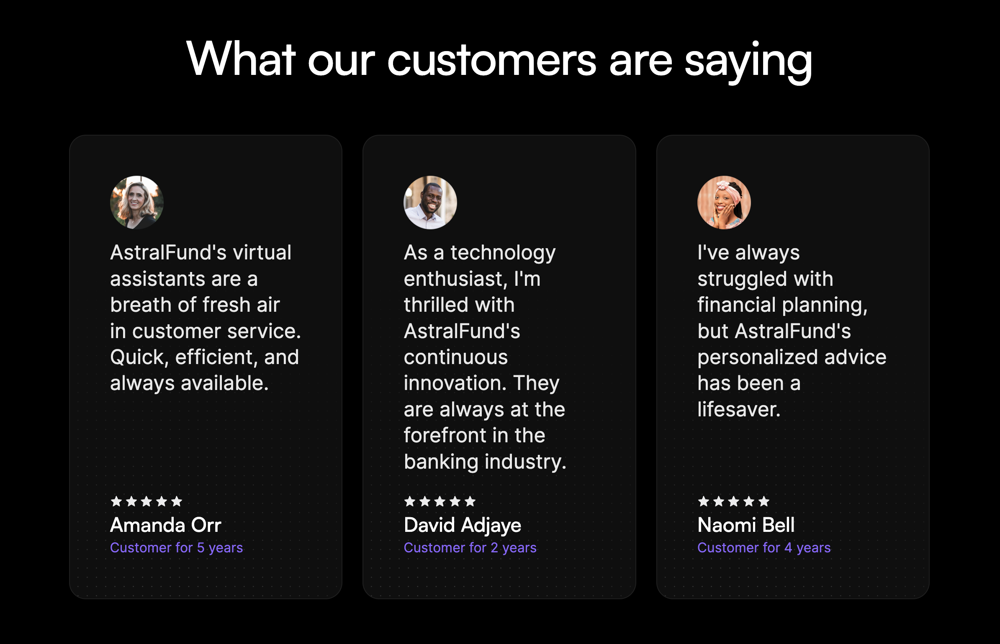
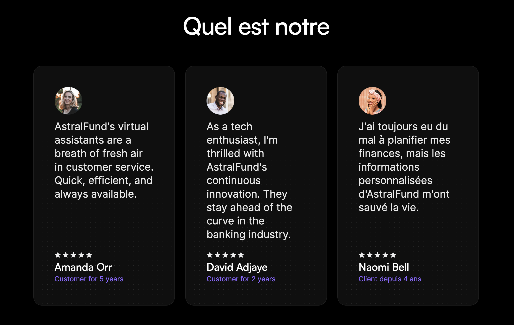

# Localizing a Site

## What is Localization?

Webflow Localization is a native, end-to-end solution for customizing your website for visitors around the world --from design to translation to publishing.

For businesses of any size to scale internationally, they need to be able to truly tailor their websites to resonate with global audiences. Localization includes but goes far beyond translation, or simply converting the text on your site to a different language. It means customizing anything from the design to what images you choose to unique content per locale. It also means making sure your site is easily discoverable by the people and prospects in the regions you’re targeting.

## How can I use these APIs?

Webflow's localization APIs empower developers to efficiently automate and manage the localization process across multiple sites, ensuring consistency and quality. With these APIs, your apps can help users make dynamic content updates and enable custom localization workflows, providing scalability for growing businesses that are looking to enhance global user engagement and optimize performance for international audiences.

---
# Tutorial
In this tutorial, we'll use a mockup site for a fintech application, AstralFund, and walk through the process of localizing content for a French audience. By the end of this tutorial, you'll have a fully localized “Contact Us” page and a new testimonial that resonates with your French audience. Ready to start? Let's dive in!

### What You’ll Learn
- [ ] Identifying primary and secondary locales within Webflow.
- [ ] Localizing the DOM elements like text and images.
- [ ] Optimizing SEO data for different locales.
- [ ] Managing CMS content across multiple locales.

### What You'll Need
- [ ] [AstralFund Site Cloneable](https://webflow.com/design/astralfund-919afdc1091df68b8dc1347f952a)
- [ ] Our [Localization Example Repo](https://github.com/Webflow-Examples/Localization-Demo) with code samples and localized data
- [ ] A Webflow site plan that supports CMS
- [ ] A Bearer Key
- [ ] Some knowledge of HTTP requests and JavaScript

### Localization in Action
AstralFund, an imaginary bank for this example, serves two locales, the United States and France. To properly address each market’s needs, the bank needs to localize content throughout the site. In the example, we’ve localized some content, but we’ll walk through how to localize the entire site in this tutorial.

|  |  |
| -------- | ------- |
|  |  |
| **Primary Locale: United States 🇺🇸**  | **Secondary Locale: France 🇫🇷**  |
The site's primary locale is set to the United States with content in English. | A secondary locale for France is available, with the homepage localized in French. Notice, the localized image and the decimals replaced by commas. However, some content, like the testimonials, still needs to be localized. |

### Step 1: Clone AstralFund and Identify Localization Opportunities

- [ ] **Clone the Example Repository** to get the localized example data. There's an full example of all the steps below in `index.js`, but if you want to follow along step by step create a new file called `localization.js` with the following imports. Here we're importing the translated content we'll need to localize our site, and the Webflow Javascript SDK.

```javascript
import localizedDOM from "./helpers/Contact Us - French.json" assert {type: "json"}// Localized "Contact Us DOM
import localizedMetadata from "./helpers/seoData.json" assert {type: "json"}// Localized SEO Data
import frenchTestimonials from "./helpers/Testimonials - French.json" assert {type: "json"}// Localized Testimonials
import newTestimonial from "./helpers/newTestimonial.json" assert {type: "json"} // New French Testimonial
import Webflow from "webflow-api"
```

- [ ] **Clone the AstralFund site** to your Webflow account, and add it to a workspace used for testing.
- [ ] **Publish the site** to set it live.
- [ ] **Navigate to the French locale** to see the localized French homepage.
- [ ] **Navigate to the Contact page in French.** Note the content that is not yet localized. We’ll fix this by localizing the navigation bar, contact content, form, footer, and SEO data.

### Step 2: Retrieve Locale Identifiers

#### In this step we'll retrieve the site and locale identifiers, so that we can make locale specific requests to our site

- [ ] Make sure you have a valid Bearer Key that is authenticated for your new site. You can easily do this by authenticating through our API reference docs. Once you have your Bearer Key, you can store it in your .env file as `WEBFLOW_API_TOKEN`


- [ ]  Initialize the API using the [Webflow Javascript SDK](https://github.com/webflow/js-webflow-api)

```
    const webflow = new Webflow(
      { token: process.env.WEBFLOW_API_TOKEN,
        beta: true
      });
```

- [ ] Call the List Sites endpoint to find your `siteId` and `locale` information
- [ ] Extract the localeId for both English and French from the Site object

  - Notice the `locales` parameter, which returns a `primary` locale, and an array of `secondary` locales
  - Each locale has useful information like the language, location, and more.
  - In addition to a specific `localeId`, each locale also has a `cmsLocaleId`  
    Store these IDs as variables for later use.
- [ ] Store these IDs as variables for later use.

```javascript
 // List sites and get the Astral Fund site's details
    const sites = await await webflow.get('/sites');
    const astralFundSite = sites.find(site => site.displayName.includes("AstralFund"));
    const siteId = astralFundSite.id;
    const siteDetails = await await webflow.get(`/sites/${siteId}`);
		console.log(siteDetails)


    // Extract and store locale IDs
    const locales = siteDetails.locales;
    const secondaryLocaleId = locales.secondary[0].id; // French is the first secondary locale
    const secondaryCmsLocaleId = locales.secondary[0].CmsId
    console.log([locales, secondaryLocaleId, secondaryCmsLocaleId])

```

### Step 3: Localize Page Content and SEO Data

#### In this step, we're getting the content and metadata from a static, primary page, and uploading a translated version to our locale-specific page.

- [ ] **Get the `page_id`** of the Contact Us page using the [List Pages](https://docs.google.com/document/d/1irbV_VgvpVvum0W97X5e_ZznukaK8A2NgctlIX6oA08/edit) endpoint

```javascript
   // Get the Page Info for "Contact Us"
    const pages = await webflow.get(`sites/${siteId}/pages`)
    const contactPage = pages.find(page => page.title.includes("Contact"));
    const contactPageId = contactPage.id
    console.log(contactPageId)

```

- [ ] **Get the content of the Primary Locale **using the [Read DOM ](https://dash.readme.com/go/webflow-data?redirect=%2Fv2.0.0-beta%2Freference%2Fread-dom) endpoint. This will return all localizable content from a static page, which we can then translate for our locale-specific page.

> 📘 
> 
> As of Sep 22, 2023 , we only support writing to Text and Rich Text to the DOM. We do not support updating images via this API yet.

- [ ] **Modify the content **to include localized versions of the nav bar, contact content, form, and footer. We’ve provided a localized DOM for you with `./helpers/Contact Us - French.json`
- [ ] **Update the content **of the french locale by making a `POST` request to the [Update DOM](https://docs.developers.webflow.com/v2.0.0-beta/reference/update-dom) endpoint, entering the `localeId` in the `locale` query parameter.

```javascript JavaScript
  // Get the DOM for the Contact Us page in English and translate to French
    const primaryContactPageDom = await webflow.get(`/pages/${pageId}/dom`);

    // Update the Contact Us page DOM with French content
    const contactFrench = await webflow.put(`/pages/${pageId}/dom?locale=${locale}`, localizedDOM);
		console.log(contactFrench)

```

#### Now, let's get page metadata to update the SEO and OpenGraph data

- [ ] **Retrieve the primary page's SEO data **via a `GET` request to the [Get Page Metadata ](https://docs.developers.webflow.com/v2.0.0-beta/reference/get-page-metadata)endpoint
- [ ] **Translate** the data so that it's relevant for the French audience. We’ve provided localized information for you with `./helpers/seoData.json`
- [ ] **Update the SEO Data** for the french locale' via a `POST` request to [Update Page Metadata](<>)endpoint. Be sure to enter the `localeId` in the `locale` query parameter.

```javascript
  // Get and update page metadata with localized SEO data
    const pageMetadata = await webflow.get(`/pages/${pageId}`)
    const frenchMetadata = await webflow.post(`/pages/${pageId}`, metadata)
    console.log(frenchMetadata)

```

### Step 4: Manage Testimonials with the CMS

#### To demonstrate AsrtralFund’s commitment to the French market, we'll translate the existing testimonials, and create a French-specific testimonial from a French regulatory authority.

- [ ] **Get existing testimonials **and translate them using our provided translation.
- [ ] For each translated testimonial, **update the CMS item** via the [Update Collection Item](ref:update-item) endpoint. Be sure to include `cmsLocaleId` in the body of the request. If you're using our translated data, one of the testimonials will be set to draft, so that we can highlight the French-only testimonial that we'll create in the next step.

```javascript
  // Get CMS data for testimonials
    const collections = await webflow.get(`/sites/${siteId}/collections`);
    const testimonialsCollectionId = collections.data.collections.find(collection => collection.displayName === 'Testimonials').id;
    const testimonials = await webflow.get(`/collections/${collectionId}/items`);

// Translate Testimonials
  try{

    let items = []
    for (const item of cmsItems){

      const updatedItem = await webflow.patch(`/collections/${collectionId}/items/${item.id}`, { 
cmsLocaleId: cmsLocaleId, 
fieldData:item.fieldData
})
      items.push(updatedItem.data)
    }

    return items

  } catch (error) {
    console.error(`Error updating CMS items:`, error)
    throw error;
  }
}

```

- [ ] **Create a French-only testimonial** using our provided translation.

```javascript
const newTestimonial = await webflow.post(`/collections/${collectionId}/items/live`, { cmsLocaleId: cmsLocaleId, fieldData:testimonial});

```

### Step 5: Appreciate your beautifully localized site! 👏